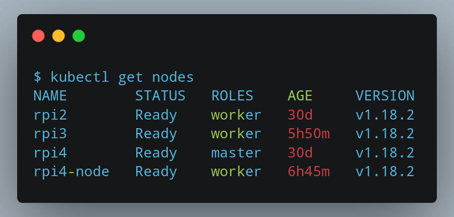
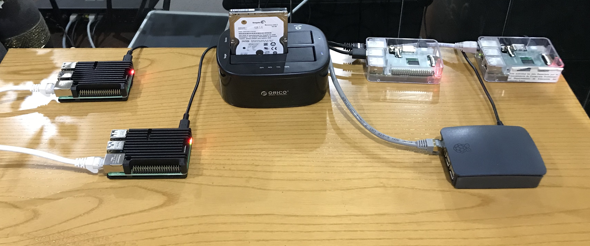

# Apertura Raspinetes

Este no es más que un post de bienvenida que sirve como primera entrada de este blog. Como se puede ver en la página principal, el blog está alojado en un clúster de Raspberry Pi bajo [Kubernetes](https://kubernetes.io/).

El clúster consta de un total de 4 Raspbery Pi + 1 Raspberry Pi.

* **Nodo Master**: Raspberry Pi 4

* **Workers**: 1 Raspberry Pi 4 + 1 Raspberry 3 + Raspberry 2

A pesar de que tal y como se encuentra actualmente el clúster no es muy vistoso, una fotografía nos puede ayudar a imaginarnos toda la infraestructura que está detrás.

Con el paso del tiempo iremos mejorando su aspecto visual, añadiendo algunos componentes extras para que todo quede organizado. Algunos de los componentes más interesantes:

* [Raspberry PoE HAT](https://www.raspberrypi.org/products/poe-hat/)

* [Switch PoE 8 Puertos](https://www.amazon.com/NETGEAR-Gigabit-Ethernet-Unmanaged-Desktop/dp/B082G2G2F8/ref=as_li_ss_tl?keywords=power%2Bover%2Bethernet%2Bswitch&qid=1551669347&s=gateway&sr=8-3&linkCode=ll1&tag=mmjjg-20&linkId=913b582b324bf6a8f9cbe31db94f99e6&language=en_US&th=1)

* [Caja clúster Rpi](https://www.pccomponentes.com/joy-it-tower-case-para-raspberry-pi)

Esto nos permitiría tener todas las Raspberry agrupadas y prescindir de todas las fuentes de alimentación externas ya que se alimentaría a través de los puertos PoE del switch. 

Un ejemplo de como podría quedar estéticamente.

_Fuente: https://www.pidramble.com_
