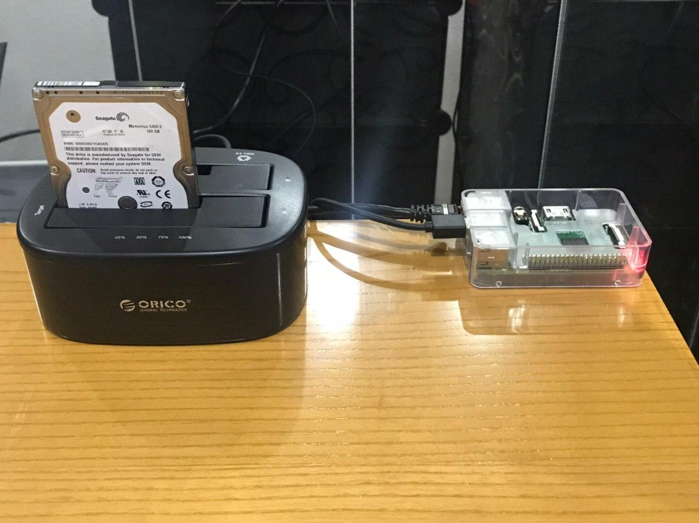

# Persistencia de datos

Sabemos que los Pods y los datos que estos contienen son efímeros, de ahí que necesitemos algún modo de mantener algunos datos peristentes para que no desaparezcan junto a los Pods. Los volumenes nos proporiconan la persistencia de datos que necesitamos.

Kubernetes dispone de varios tipos de volúmenes persistentes, en este caso vamos a optar por el tipo **NFS** ya que no estamos utilizando ninguna plataforma Cloud para nuestro clúster. El servidor NFS se encuentra en una Raspberry Pi 2, que no forma parte del clúster, la cual tiene conectado un disco duro externo vía USB que será el lugar donde se almacenarán los datos persistentes de los diferentes Pods.



### Volumenes Persistentes Kubernetes

Para que la configuración de Kubernetes sea la más adecuada hemos utilizado tanto **PersistenteVolume** como **PersistenteVolumeClaim**.

¿En qué consisten cada uno de ellos?

- **PersistentVolume**: hacer referencia a un espacio de almacenamiento que la vida útil de este es independiente a la de un Pod o contenedor. Si un Pod muere el volumen no se verá afectado, lo que nos permite que los datos sean persistente. Un ejemplo del manifiesto que define este objeto.
  
  ```yaml
  apiVersion: v1
  kind: PersistentVolume
  metadata:
    name: ghost-blog-nfs
    namespace: ghost-blog
    labels:
      volume: ghost-nfs
  spec:
    storageClassName: storage-nfs
    capacity:
      storage: 10Gi
    accessModes:
      - ReadWriteMany
    nfs:
      server: 192.168.11.220
      path: "/nfs/ghost"
  ```
  
  Es necesario destacar varios puntos del manifiesto anterior:
  
  - **storageClassName**: permite asignar al volumen persistente una clase, la cual solo puede ser vinculada por un **PersistentVolumeClaim** que solicite dicha clase. Es posible utilizar también un **selector**, y en el caso de que se utilicen ambos será necesario que PV y PVC coincidan.
  
  - **accessModes**: disponemos de diferentes modos de accesos en función de los permisos que nos otorgan.
    
    - ReadWriteOnce --> el volumen puede ser montado con acceso de lectura y escritura por un único nodo.
    
    - ReadOnlyMany --> el volumen puede ser montado con acceso de solo lectura por cualquier nodo.
    
    - ReadWriteMany --> el volumen puede ser vomtado con acceso de lectura y escritura por cualquier nodo.

- **PersistentVolumeClaim**: los **PersistentVolume** exclusivamente crean un espacio de almacenamiento, por lo tanto necesitamos un objeto que sea capaz de reclamar/consumir ese espacio que hemos dispuesto. De esto se encargan los **PersistentVolumeClaim**. Un ejemplo podemos verlo en el siguiente manifiesto:
  
  ```yaml
  apiVersion: v1
  kind: PersistentVolumeClaim
  metadata:
    name: ghost-blog-nfs-pvc
    namespace: ghost-blog
  spec:
    storageClassName: storage-nfs
    selector:
      matchLabels:
        volume: ghost-nfs
    accessModes:
      - ReadWriteMany
    resources:
      requests:
        storage: 10Gi
  ```

### Servidor NFS

Atendiendo a la documentación oficial de Kubernetes, para poder utilizar volúmenes persistentes del tipo NFS es necesario que los nodos que hagan uso de este tipo de volúmenes tengan el programar `/sbin/mount.nfs`.

Partiendo de la base que el Sistema Operativo que alberga el clúster de Kubernetes es CentOS, ejecutaremos una serie de comandos para su instalación.

* Comprobar qué paquete nos proporciona el programa nfs.
  
  ```bash
  yum provides /sbin/mount.nfs
  ```
  
  Nos mostrará como resultado **nfs-utils**. Es muy probable que lo tengamos ya instalado.

* Comprobar si el paquete se encuentra instalado en el sistema.
  
  ```bash
  yum list installed | grep nfs-utils
  ```

        Si encuentra el paquete significa que este se encuentra instalado.

* Si el paquete no estuviese instalado, deberemos ejecutar el siguiente comando para su instalación.
  
  ```bash
  yum install nfs-utils
  ```

##### Configuración Raspberry Pi 2

En nuestro servidor NFS debemos editar el fichero de configuración `/etc/exports`, el cual controla qué sistemas de arcivhos son exportados además de espcificar las diferentes opciones. Para el Pod que contiene el contenedor con el [CMS Ghost](https://ghost.org/) hemos añadido la siguiente línea:

```
/nfs/ghost 192.168.11.0/255.255.255.0(rw,no_root_squash)
```

Las opciones especificadas son las siguientes:

* **rw**: nos permite tanto lectura como escritura. 

* **no_root_squash**: permite que el usuario root se "mapee" con el usuario root del servidor NFS. Hay que tener en cuenta que a nivel de seguridad no es lo más acertado.

Por otro lado, debemos configurar dos aspectos de seguridad para que el servidor NFS funcione correctametne.

* **Firewall**:

```bash
firewall-cmd --permanent --add-service=mountd
firewall-cmd --permanent --add-service=nfs
firewall-cmd --permanent --add-service=rpc-bind
firewall-cmd --reload
```

* **Selinux**:

```bash
setsebool -P nfs_export_all_ro=1 nfs_export_all_rw=1
```

Una vez que tenemos el Pod en marcha, si nos conectamos al servidor NFS podemos ver que hay contendio relacionado con el Pod. Este contenido si el Pod desaparece se mantendrá.


### Referencias

* [accessModes](https://kubernetes.io/docs/concepts/storage/persistent-volumes/#access-modes)

* [PersistentVolumes-class](https://kubernetes.io/docs/concepts/storage/persistent-volumes/#class)

* [Kubernetes: Volúmenes NFS - El Blog de Jorge de la Cruz](https://www.jorgedelacruz.es/2017/12/26/kubernetes-volumenes-nfs/)

* [TipsAndTricks/SelinuxBooleans - CentOS Wiki](https://wiki.centos.org/TipsAndTricks/SelinuxBooleans)
