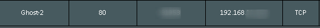
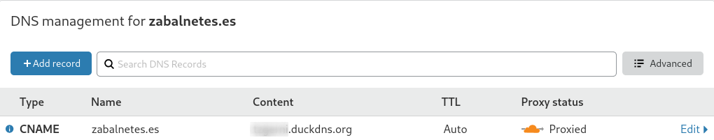

# Hola Mundo

Este post que podríamos confundirlo con el post de [Bienvendia](https://zabalnetes/bienvenida) vamos a explicar cual es la configuración que necesitamos para que este blog sea accesible desde el exterior a través del dominio **zabalnetes.es**.

En primer lugar, debemos configurar el clúster para que las aplicaciones que estén corriendo en él sean accesibles desde el exteriror. En Kubernetes disponemos de diferentes tipos de servicios para ello, como por ejemplo **NodePort** o **LoadBalancer** (utilizado en Plataformas Cloud).

Debido a que nuestro clúster está formado por un conjunto de Raspberry Pi, la mejor opción que tenemos es un objeto **Ingress** el cual se encarga del acceso externo a los servicios del clúster. Para que un objeto de tipo Ingress funcione necesitamos un **controlador ingress**. Disponemos de diferentes controladores, entre ellos [Nginx](https://github.com/kubernetes/ingress-nginx), [HA](https://github.com/haproxytech/kubernetes-ingress) o [Traefik](https://github.com/containous/traefik/). El que hemos utilizado ha sido Traefik por su extensa documentación.

Los manifiestos referentes a poner en marcha el controlador de Traefik los podemos encontrar en [este enlace](). Hay varios puntos importantes a destacar dentro de alguno de estos manifiestos.

* Deployment:
  
  * La imagen del contenedor está definida con el **tag 1.7**. Es importante mantener esta versión con estos manifiestos, ya que en la última versión (**2.2** en el momento de publicación de este post) hay varios cambios y no nos funcionará.
  
  * En la sección **spec** es necesario definir un nodo en particular, necesitamos una ip fija de nuestra red local para mapear puertos, que será la de este nodo.
    
    ```yaml
    spec:     
      nodeSelector:
        kubernetes.io/hostname: rpi4-node
    ```

* Servicio
  
  * En el servicio de tipo NodePort hemos asignado un puerto fijo, de lo contrario es Kubernetes quien se encarga  de asignar un puerto aleatorio dentro del rango de puertos **3000-32767**. Necesitaremos recordar el puerto NodePort asignado al puerto 80 para añadirlo en la configuración de nuestro router.

Los siguientes pasos que debemos realizar no están relacionados con el clúster, pero son igual de importantes ya que de lo contrario no podremos llegar al Pod donde se encuentra Ghost.

Vamos a comenzar con la configuración del router (Asus RT-AC3200). Por un lado, debemos abrir el puerto 80 para recibir peticiones http, pero este puerto abierto debe redireccionar al puerto NodePort que hemos definido de forma estática en el manifiesto de traefik.



Por otro lado, es muy probable que el servicio de internet que tenemos contratado con nuestro proveedor no nos proporcione una IP pública fija, por lo que un registro DNS apuntando a nuestra IP no tendrá sentido ya que esta puede variar en cualquier momento.

Para solventar este pequeño problema utilizaremos un servicio llamado DNS dinámico, el cual asocia un nombre de dominio a nuestra IP pública. Si esta cambia el DNS dinámico es capaz de actualizar sus registros, por lo que siempre nos llevará a la IP pública correcta. El servicio utilizado ha sido [DuckDNS](https://www.duckdns.org/), es muy sencillo de configurar y  proporciona diferentes guías de configuración para que la relación entre dominio e IP pública funcione correctamente. Para conocer como configurar DuckDNS en un router Asus visitar [este enlace](https://tzinm.github.io/mis-apuntes/Asus/Custom-DDNS/).

Para terminar, una vez que tengamos el dominio reservado vamos a utilizar un servidor CDN. El motivo es que nos proporcionará una serie de ventajas realmente interesantes para un blog personal que tengamos alojado en nuestra red local.

* Soporte HTTPS. 

* Oculta la IP pública de mi red local.

El servidor CDN que hemos utilizado ha sido [Cloudflare](https://www.cloudflare.com/), dispone de un plan gratuito para blogs personales que es suficiente para nosotros. Una vez que nos creamos una cuenta gratuita nos explican los pasos a seguir, básicamente se trata de sustituir los DNS de nuestro dominio por las de Cloudflare. 

Después deberemos añadir un registro para que apunte a nuestro DNS dinámico.




